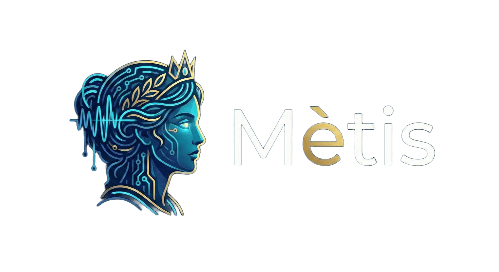

# 
    <h3>AI Meeting Assistant</h3> 

 

Mètis is a browser extension (Chrome/Edge) that acts as a strategic advisor during video conferences. Unlike standard transcription tools, Mètis does not just transcribe the conversation but actively listens to provide real-time support.

## Key Features

### Active Listening

The extension hooks into the browser tab's audio, allowing it to analyze what speakers are saying on platforms like Google Meet, Microsoft Teams, or Zoom Web.

### AI Analysis

The system sends conversation segments to artificial intelligence (Google Gemini) when it detects pauses or specific questions, ensuring precise context analysis.

### Live Suggestions

Mètis displays an overlay (a semi-transparent window) directly over the call video. It provides suggestions on how to answer technical questions or summaries of critical points just discussed.

### Non-Intrusive

The application runs entirely within the browser, without requiring the installation of heavy desktop software.

## Technical Details

The architecture is based on Chrome's Manifest V3 standard and uses advanced techniques to overcome modern browser security limitations.

- **Tab Capture API**: Uses privileged permissions to capture the digital audio stream (MediaStream) directly from the active tab, ensuring clean audio free of ambient noise, bypassing the physical microphone.

- **Offscreen Document Pattern**: Since Chrome Service Workers do not have access to the DOM (required for Audio and SpeechRecognition APIs), Mètis instantiates an invisible HTML document ("offscreen") that processes audio in the background.

- **Web Speech API**: Speech-to-Text transcription occurs locally in the browser within the offscreen document, ensuring low latency and zero costs for transcription.

- **LLM Integration (Gemini)**: The transcribed text is sent to the Google Gemini API (Flash model, optimized for speed) with a specific System Prompt that instructs the AI to act as a strategic assistant.

- **Content Injection**: The user interface is injected into the host page DOM via Content Scripts, allowing drag-and-drop interaction over the native video.

## Installation

1. Clone the local repository.
2. Open the browser (Chrome or Edge) and navigate to `chrome://extensions`.
3. Enable "Developer mode" in the top right.
4. Click on "Load unpacked".
5. Select the project folder.

## Configuration and Usage

1. Obtain a valid API Key for Google Gemini.
2. Click on the extension icon in the toolbar.
3. Enter the API Key in the dedicated field and save.
4. Start a video conference on one of the supported platforms.
5. Open the extension popup and press "Start Capture".

## Requirements

- Google Chrome or Microsoft Edge (recent versions with Manifest V3 support).
- Active internet connection for API calls to Google Gemini.

## Privacy

Audio transcription occurs locally on the user's device. Only text segments necessary for analysis are sent to Google Gemini APIs.
